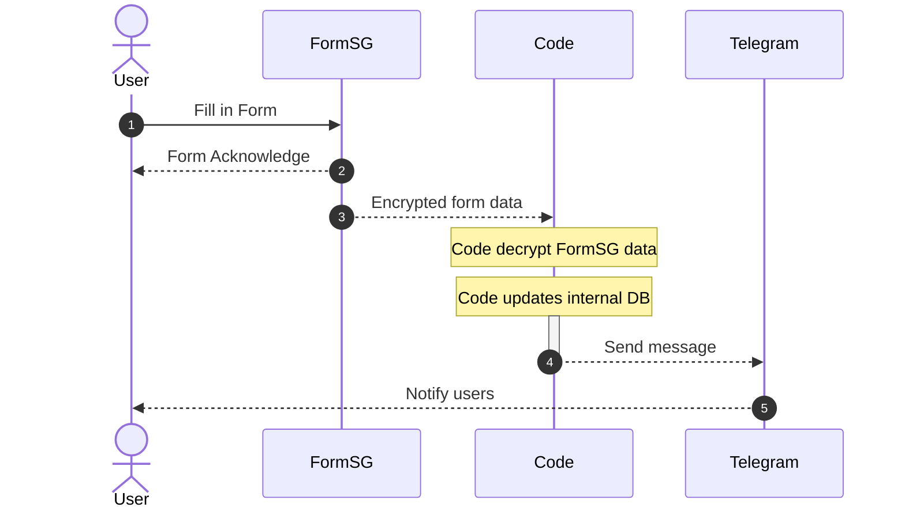

# Documentation for Army News Digital Logbook

### System Design



## Deployment

Google Cloud Platform is recommended for its generous free tier.

> - 2 million requests per month
> - 360,000 GB-seconds of memory, 180,000 vCPU-seconds of compute time
> - 1 GB of outbound data transfer from North America per month

### Instructions to deploy locally
- Ensure you have Docker installed
  
1. `docker image build -t ims .`
2. `docker run -p 8080:8080 -d ims`
3. Navigate to [localhost:8080](http://localhost:8080).
   1. You should expect an "Online" response

### Instructions to deploy to GCP

1. In the Google Cloud console, on the project selector page, create a Google Cloud project named `ims-project`.
2. Make sure that billing is enabled for your Google Cloud project.
3. [Install the Google Cloud CLI](https://cloud.google.com/sdk/docs/install).
4. To initialize the gcloud CLI, run the following command:
   ```sh
   gcloud init
   ```
5.  `gcloud config set project ims-project`
6.  `gcloud builds submit --tag gcr.io/ims-project/ims-image`
7.  ```sh
    gcloud run deploy ims-instance \
      --image gcr.io/ims-project/ims-image \
      --platform managed --region "us-west1" \
      --allow-unauthenticated \
      --update-env-vars BOT_API_KEY=<YOUR_BOT_API_KEY>,MY_CHANNEL_NAME=<YOUR_CHANNEL_ID>,SECRET_KEY=<YOUR_FORMSG_SECRET_KEY>
    ```
    1. When the command completes, you should see something like:
       1. ```
          Service [ims-instance] revision [ims-instance-00001] has been deployed and is serving traffic at https://sample-flask-example-x5yqob7qaq-uc.a.run.app
          ```
    2. Make a note of the endpoint in the message. Open a new browser and enter the URL. Expect an "Online" response.
    3. Using this URL, edit your FormSG webhook to point to this URL.
    4. If you did not manage to include the environment variables during deployment, you can change it in `service.yaml` and run `gcloud run services replace service.yaml`.